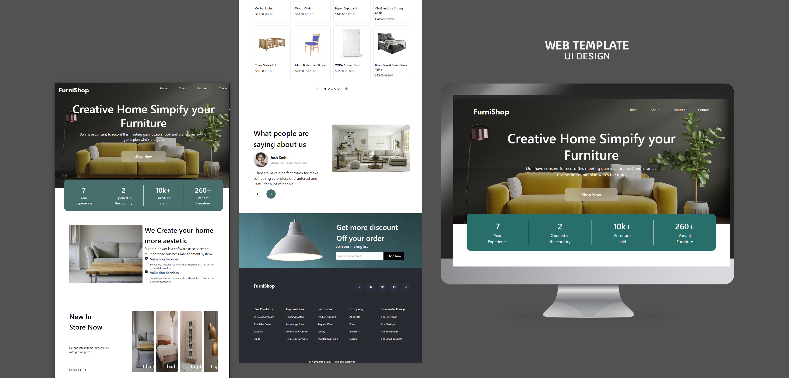

# 🛋️ FurniShop - Modern Furniture Store Frontend

**FurniShop** is a modern, responsive, and elegant frontend interface for a furniture e-commerce store. Built with **Tailwind CSS** and **TypeScript**, the design emphasizes simplicity, performance, and accessibility across all screen sizes.

---

## 🚀 Features

- ⚡️ Fast and responsive layout (mobile-first)
- 🎨 Beautiful UI built with **Tailwind CSS**
- 🔠 Written in **TypeScript** for type safety
- 📱 Mobile navigation menu with animation
- 🌗 Dark background theme for a modern look
- 🧩 Clean component structure
- 💡 Easy to customize and extend

---

## 🖥️ Tech Stack

| Technology   | Description                 |
| ------------ | --------------------------- |
| HTML5        | Semantic markup             |
| Tailwind CSS | Utility-first CSS framework |
| TypeScript   | Strongly-typed JavaScript   |

---

## 📂 Project Structure

```
furnishop/
├── public/
│   └── images/
├── src/
│   ├── assets/
│   ├── components/
│   └── styles/
├── index.html
├── main.ts
├── tailwind.config.js
└── README.md
```

---

## 📸 Screenshots



---

## 📦 Installation

```bash
# 1. Clone the repository
git clone https://github.com/your-username/furnishop.git
cd furnishop

# 2. Install dependencies
npm install

# 3. Run the development server
npm run dev
```

> Make sure you have **Node.js** and **npm** installed on your machine.

---

## 🛠️ Development Scripts

| Script            | Description              |
| ----------------- | ------------------------ |
| `npm run dev`     | Run development server   |
| `npm run build`   | Build production assets  |
| `npm run preview` | Preview production build |

---

## 🧱 Customization

You can modify:

- Colors and spacing in `tailwind.config.js`
- Images in the `/public/images` directory
- Layout in the component files

---

## 🤝 Contributing

Feel free to fork this project, submit pull requests, or suggest new features. All contributions are welcome!

---

## 📄 License

This project is licensed under the **MIT License**.

---

## ✨ Author

Made with ❤️ by **Mustafa Alarifi**

- GitHub: [Mustafa-Alarify-GitHub](https://github.com/Mustafa-Alarify-GitHub)
- Email: m771071760@gmail.com
